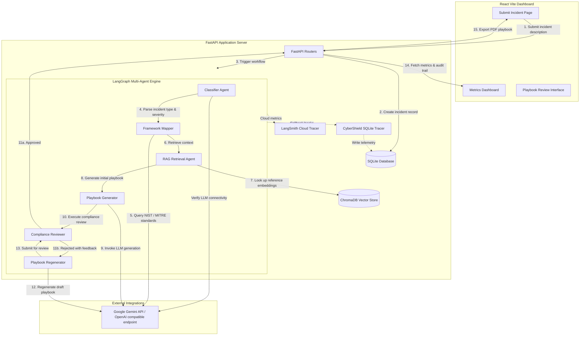

# CyberShield AI

CyberShield AI is an enterprise-grade, **Agentic AI Incident Response Playbook Generator** designed to automate, assess, and streamline response operations. Powered by a multi-agent **LangGraph** engine, integrated **Enterprise RAG** knowledge bases, and built-in compliance review systems, CyberShield AI guides security operations centers (SOC) from incident classification to approved playbook production.

---

## 📋 Problem Statement

Modern Security Operations Centers (SOC) face an overwhelming volume of security alerts, complex regulatory environments (e.g., NIST, HIPAA, GDPR), and a shortage of specialized security analysts. Traditional incident response relies on static playbooks that fail to adapt to complex, multi-stage attacks. 

**CyberShield AI** bridges this gap by automatically converting raw incident descriptions into highly customized, framework-mapped, and compliance-checked playbooks. By automating classification, referencing context-aware Knowledge Bases (RAG), and enabling a strict human-in-the-loop review workflow, it dramatically reduces response latency while maintaining human oversight.

---

## ⚡ Key Features

*   **Incident Submission**: Simple, parameterized API and user interface for analysts to log incident descriptions.
*   **Agentic Workflow Orchestration**: Powered by **LangGraph** to coordinate six specialized AI agents sequentially or conditionally.
*   **Enterprise RAG Retrieval**: Indexing and semantic searching of NIST guidelines, MITRE ATT&CK techniques, and OWASP guides via ChromaDB.
*   **Custom Playbook Generation**: Automatically creates comprehensive, markdown-formatted playbooks.
*   **Compliance Review & Score**: Evaluates the generated playbook drafts against frameworks and issues compliance scores and gap reviews.
*   **Human-in-the-Loop Workflow**: Allows analysts to review playbooks, write feedback, and trigger iterative regenerations or approve playbooks.
*   **Audit Logging**: Keeps an immutable database log of all agent runs, execution latency, and human actions.
*   **Observability & Tracing**: Two-tier tracing system using LangSmith cloud integration or a local self-hosted SQLite fallback database.
*   **Health Checks**: Built-in endpoint `/api/healthz` reporting RAG status, agent readiness, and active tracing systems.

---

## 🏗️ Architecture

CyberShield AI is split into a modular backend server and an interactive dashboard frontend:

### 1. Frontend
*   A Vite-powered React single-page application that allows analysts to submit incidents, view real-time metrics, audit logs, and manage the playbook review/approval queue.

### 2. Backend
*   A FastAPI Python server providing API endpoints, orchestrating the database transactions, managing ChromaDB vector stores, and invoking the agentic pipeline.

### 3. LangGraph Workflow
The system utilizes a structured state graph that transitions through the following nodes:
`classify` (incident classification) → `map_frameworks` (framework mapping) → `retrieve_rag` (RAG lookup) → `generate_playbook` (playbook generation) → `review_compliance` (regulatory review) ──(Conditional Routing: Approved/Rejected)──► `regenerate_playbook` (iterative improvement if rejected) OR `END`.

### 4. Observability & Tracing
Integrates cloud tracing via LangSmith or a local Python callback handler class (`CyberShieldTracer`) writing telemetry to SQLite.

### 🗺️ System Architecture Diagram



---

## 🛠️ Technology Stack

*   **Frontend**: React (Vite), TypeScript, TailwindCSS, Radix UI, Framer Motion, Recharts.
*   **Backend**: Python (FastAPI, Uvicorn), SQLAlchemy (ORM).
*   **AI/LLM Execution**: LangGraph, LangChain core, OpenAI SDK (acting as a client to Google Gemini compatibility endpoint).
*   **Vector Database**: ChromaDB (Persistent client, semantic search, text embeddings).
*   **Observability**: LangSmith SDK, SQLite custom callbacks.
*   **Deployment**: Docker, Docker Compose, Replit, Render.

---

## 🏃 Local Development Setup

### Prerequisites
*   **Python**: `v3.11` or `v3.12`
*   **Node.js**: `v20.x` or higher
*   **npm**: `v10.x` or higher
*   **Git**

---

### Backend Setup (Python)

1.  Navigate to the backend server directory:
    ```bash
    cd artifacts/api-server
    ```
2.  Install dependencies:
    ```bash
    pip install -r requirements.txt
    pip install fpdf2
    ```
3.  Prepare your environment configuration file:
    Create a `.env` file inside `artifacts/api-server/` with placeholders (see **Environment Variables** section below).
4.  Run the backend server:
    ```bash
    python main.py
    ```
    *The database tables will be initialized, reference vectors will be ingested into ChromaDB, and the FastAPI application will start on `http://localhost:8080`.*

---

### Frontend Setup (Vite React)

1.  Navigate to the frontend directory:
    ```bash
    cd artifacts/cybershield
    ```
2.  Install npm packages:
    ```bash
    npm install
    ```
3.  Launch the development server:
    ```bash
    npm run dev
    ```
    *The frontend starts on `http://localhost:5173/` and proxies all `/api` requests to the backend.*

---

### Environment Variables

Configure these settings inside [artifacts/api-server/.env](artifacts/api-server/.env).

#### Google Gemini Configuration (Recommended)
```env
# Enable Gemini OpenAI-compatible gateway
OPENAI_BASE_URL=https://generativelanguage.googleapis.com/v1beta/openai/
OPENAI_API_KEY=YOUR_GEMINI_API_KEY_HERE   # Begins with AIzaSy...

# Set Gemini Models
FAST_LLM_MODEL=gemini-2.5-flash
SLOW_LLM_MODEL=gemini-2.5-flash
EMBEDDING_MODEL=gemini-embedding-001
PORT=8080
```

#### OpenAI Configuration (Alternative)
```env
OPENAI_API_KEY=YOUR_OPENAI_API_KEY_HERE    # Begins with sk-...
PORT=8080
```

#### LangSmith Tracing Configuration (Optional)
```env
LANGSMITH_API_KEY=YOUR_LANGSMITH_API_KEY_HERE
LANGCHAIN_TRACING_V2=true
LANGCHAIN_PROJECT=cybershield-ai
```

---

### Health Check

The backend exposes a health endpoint at:
`http://localhost:8080/api/healthz` (or proxied via `http://localhost:5173/api/healthz`).

**Example Response**:
```json
{
  "status": "healthy",
  "version": "1.0.0",
  "rag_initialized": true,
  "agents_ready": true,
  "langsmith_enabled": false,
  "tracing": "self-hosted-sqlite"
}
```

---

## 🧪 Testing & Code Quality

*   **Linting & Style Checks**: Evaluated using **Ruff** inside python files.
*   **Static Type Checking**: Managed via **MyPy** on the backend and **TypeScript Compiler (tsc)** on the frontend.
*   **Test Runner**: Execute automated test files via Pytest:
    ```bash
    pytest
    ```
*   **Frontend Type Check**: Verify frontend React files:
    ```bash
    npm run typecheck
    ```

For a detailed review of codebase design patterns, input checks, and error boundaries, see the [CODE_QUALITY_ANALYSIS.md](CODE_QUALITY_ANALYSIS.md) document.

---

## 📊 Observability Details

*   **Immutable Audit Logs**: Structured audit entries are committed to the `audit_logs` SQL table.
*   **Local Self-Hosted Tracing**: The custom class `CyberShieldTracer` intercepts chain hooks (`on_llm_start`, `on_chain_end`, etc.) and stores raw payload data inside the `traces` table for debugging without cloud dependencies.
*   **LangSmith Support**: Instantly activates cloud tracking if valid API credentials are set in the environment variables.

For a detailed review of the tracing execution, metrics dashboard APIs, and log configurations, see [OBSERVABILITY_ANALYSIS.md](OBSERVABILITY_ANALYSIS.md).

---

## 🐳 Docker Deployment

The application provides a comprehensive `docker-compose.yml` config at the workspace root to orchestrate both backend and frontend containers:

1.  Define environment keys inside a `.env` file at the root repository directory.
2.  Deploy and build containers:
    ```bash
    docker-compose up --build
    ```
3.  View the React interface at `http://localhost` (proxying calls to the backend running inside the container).

---

## 📂 Project Structure

```
├── .dockerignore
├── .replit
├── docker-compose.yml
├── render.yaml
├── replit.nix
├── tsconfig.base.json
├── CODE_QUALITY_ANALYSIS.md
├── OBSERVABILITY_ANALYSIS.md
├── GITHUB_RELEASE_CHECKLIST.md
├── artifacts/
│   ├── api-server/                 # Python Backend (FastAPI, LangGraph)
│   │   ├── agents/                 # LLM Multi-agent definitions
│   │   ├── db/                     # DB schemas & database engines
│   │   ├── graph/                  # LangGraph state workflow compile
│   │   ├── models/                 # FastAPI request/response validation schemas
│   │   ├── prompts/                # Raw agent text instructions templates
│   │   ├── rag/                    # Embedding service & ChromaDB connectors
│   │   ├── reports/                # PDF Report compilation logic
│   │   ├── routes/                 # FastAPI router endpoints
│   │   ├── security/               # Prompt guards & SQL/XSS sanitization
│   │   ├── tests/                  # Unit, Integration, and Graph test files
│   │   ├── utils/                  # SQLite Trace callback handlers
│   │   ├── Dockerfile
│   │   ├── main.py
│   │   └── requirements.txt
│   ├── cybershield/                # React Dashboard Frontend (Vite, TSX)
│   │   ├── public/
│   │   ├── src/                    # Components, state hooks, and dashboard pages
│   │   ├── Vite.config.ts
│   │   └── package.json
│   └── mockup-sandbox/             # Preview interface environment
├── lib/                            # Shareable client adapters & database schemas
└── scripts/                        # Automation & post-merge bash scripts
```

---

## 🔮 Future Enhancements

*   **Collaborative Live Editing**: Implement real-time collaboratively editable playbooks for SOC analysts using WebSockets.
*   **SIEM Trigger Connectors**: Build plug-and-play integrations with Splunk and Microsoft Sentinel to trigger playbooks automatically.
*   **Agent Parallelization**: Parallelize the NIST framework mapping and compliance review nodes to reduce workflow latency.
*   **Role-Based Access Control (RBAC)**: Support active user authentication and distinct analyst/reviewer role separation.
